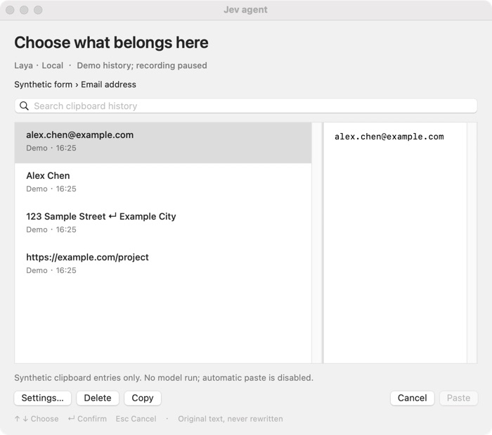

<h1 align="center">Jev agent</h1>

<h3 align="center">The right clipboard entry for the field in front of you.</h3>

<p align="center">
  A context-aware clipboard assistant for macOS.<br />
  Choose local Laya inference or the Jev API, review the suggestion, and paste the original text.
</p>

<p align="center">
  <a href="#features"><strong>Features</strong></a> &nbsp;·&nbsp;
  <a href="#how-it-works"><strong>How it works</strong></a> &nbsp;·&nbsp;
  <a href="#getting-started"><strong>Get started</strong></a> &nbsp;·&nbsp;
  <a href="#validation"><strong>Validation</strong></a> &nbsp;·&nbsp;
  <a href="./README.zh-CN.md"><strong>简体中文</strong></a>
</p>

<p align="center">
  macOS · Apple Silicon · Laya local / Jev cloud · <a href="./LICENSE">MIT</a>
</p>

> **Development preview.** The native app, history store, both providers, tests and source-build scripts are implemented. Local checks and a real Jev API probe are separate from full model and desktop acceptance. Accessibility-dependent Chrome, Safari and TextEdit workflows still require verification on the target Mac. See [the validation record](./docs/VALIDATION.md) for measured results and remaining blockers; this is not a claim of a completed production release.

<a id="features"></a>



*UI demonstration with synthetic data. This image is not evidence of a model recommendation or automatic paste.*

## Features

- **Context-aware choices:** use the current app, window title, field label and available text near the selection to select an existing clipboard entry.
- **Two providers:** Laya runs on Apple Silicon through MLX; Jev calls TypeSafe's official API. The default is Laya. Switching providers is explicit, with no automatic local-to-cloud fallback.
- **Review before pasting:** press `⌘⇧V`, inspect the recommendation, then press Return. Normal `⌘V` keeps its system behavior.
- **Original text:** preserve URLs, code, whitespace and multiline content. The model selects a record; it does not rewrite it or submit a form.
- **Bounded history:** retain at most 72 hours and 20,000,000 bytes, including record metadata and temporary history writes. Identical text is merged; oversized records are skipped intact.
- **Manual control:** search, copy, pause collection, exclude apps, delete a record or clear history. Model errors do not remove manual selection.

<a id="how-it-works"></a>

## How it works

1. Copy text while Jev agent is running.
2. Focus a supported text field and press `⌘⇧V`.
3. Jev agent captures the target before opening its panel, then retrieves up to six candidates: two recent entries plus relevant matches.
4. The selected provider chooses one candidate or “no match.” Only bounded excerpts enter the model request.
5. Review the complete original text and confirm. Jev agent checks the target again before pasting.

Arrow keys select an entry; Return confirms; Escape cancels. When the target cannot be read or safely restored, use Copy and paste manually. An email field containing several unrelated recent clipboard items is a representative evaluation scenario, not an accuracy guarantee.

## Data and permissions

| Data | Behavior |
| --- | --- |
| History | Plain text in `~/Library/Application Support/Jev agent/history`, with a 72-hour / 20 MB limit |
| Context | App, window and focused-field metadata; bounded text-range queries where supported |
| Laya | Fixed model snapshot downloaded explicitly; subsequent inference loads local files |
| Jev | The current context and shortlisted excerpts are sent to `https://api.typesafe.ai` only for requested recommendations in Jev mode |
| API key | Desktop settings use macOS Keychain; CLI tests use `TYPESAFE_API_KEY` |
| Exclusions | Confidential pasteboard markers, secure fields and configured app exclusions |
| Permissions | Accessibility is needed for supported field context and automatic paste |

There is no screenshot capture, OCR, cloud history synchronization, background cloud classification on copy, image/file support, or import from other clipboard managers. History is local plaintext, not an encrypted vault. Source attribution is recorded only when the pasteboard provides it; otherwise it is unknown. Excluded apps are also checked against the active app when a copy is observed.

The native interface currently uses English. English and Simplified Chinese project documentation are maintained together.

<a id="getting-started"></a>

## Get started

### Requirements

- Apple Silicon Mac. The native app targets macOS 14 or later; this is not a blanket guarantee for every MLX runtime version. Check [validation](./docs/VALIDATION.md) for the actual host and Laya compatibility.
- Apple Command Line Tools or Xcode, Git, and [UV](https://docs.astral.sh/uv/getting-started/installation/).
- Python 3.12, managed by UV. Network access is needed for initial dependency/model downloads and for Jev calls.

If Apple developer tools are missing:

```bash
xcode-select --install
```

After installing UV using its official instructions:

```bash
git clone https://github.com/To3akaRin/Jev-agent.git
cd Jev-agent
bash scripts/bootstrap.sh laya
open "dist/Jev agent.app"
```

Choose one bootstrap mode:

| Command | What it does |
| --- | --- |
| `bash scripts/bootstrap.sh laya` | Install locked dependencies with MLX, build, download the pinned snapshot and run a synthetic Laya smoke check |
| `bash scripts/bootstrap.sh jev` | Install without the MLX extra and build; does not download Laya or send a cloud decision |
| `bash scripts/bootstrap.sh both` | Install both provider dependencies, build, download Laya and run its smoke check |

The app is built before model download. If download or smoke testing fails, manual history remains available in the built app. A smoke check is not a quality benchmark.

Bootstrap prepares dependencies and builds; it does not grant Accessibility, populate Keychain, prove inference quality, or select Jev in your saved app settings. In the menu-bar Settings, choose the provider. For Jev, enter your own key and retain `jev-1.13.0` unless your account uses another explicitly selected model. Enable Accessibility for Jev agent in **System Settings → Privacy & Security → Accessibility**.

The app is ad-hoc signed, not Developer ID signed or notarized. It uses this checkout and its `.venv` through an absolute runtime configuration. Keep both in place; after moving the checkout, rebuild. Do not distribute this `.app` as a self-contained installer.

### Rebuild and update

Quit Jev agent from its menu before replacing the build. From the checkout:

```bash
git pull --ff-only
bash scripts/bootstrap.sh both
open "dist/Jev agent.app"
```

Use `jev` instead of `both` if you only need Jev. Saved history, app preferences and Keychain credentials are outside the build output. To rebuild without changing dependencies or downloading models:

```bash
bash scripts/build-app.sh
```

### Explicit model checks

For Laya, after installing the optional dependencies:

```bash
uv run --no-sync python -m jev_agent.cli download
uv run --no-sync python -m jev_agent.cli smoke --provider laya --timeout 10
```

For Jev, in a local terminal, replace the placeholder with your own credential. Never commit the value. The persistent ledger caps the example test session at 120 decisions; do not reset it to bypass the cap.

```bash
export TYPESAFE_API_KEY='YOUR_TYPESAFE_API_KEY'
export TYPESAFE_DEFAULT_MODEL='jev-1.13.0'
export JEV_AGENT_LIVE_BUDGET_FILE="$PWD/.runtime/jev-budget.json"
export JEV_AGENT_LIVE_BUDGET_LIMIT=120
uv run --no-sync python -m jev_agent.cli smoke --provider jev --models --timeout 10
uv run --no-sync python -m jev_agent.cli smoke --provider jev --timeout 10
```

`--models` lists account-visible models. The smoke test uses synthetic data and exits unsuccessfully if the correct email candidate is not selected. A configured client or HTTP 200 alone does not establish successful recommendations.

### Configuration

[`.env.example`](./.env.example) documents defaults; the app does **not** automatically load a `.env` file. Set desktop choices in Settings. Export variables in the shell for CLI tests; Finder-launched apps may not inherit them.

| Variable | Default / use |
| --- | --- |
| `JEV_AGENT_PROVIDER` | `laya`; alternative `jev`; saved desktop choice takes precedence |
| `JEV_AGENT_LAYA_MODEL` | `aac6fef/laya-multilingual-mlx` |
| `JEV_AGENT_LAYA_REVISION` | `ba40c87fcb357f1643d04d71323af9cdc3b9e591` |
| `JEV_AGENT_DECISION_TIMEOUT_MS` | `2000`; desktop waits at most two seconds for an interactive decision |
| `TYPESAFE_API_KEY` | Jev CLI credential; desktop credentials are stored in Keychain |
| `TYPESAFE_DEFAULT_MODEL` | `jev-1.13.0`; saved desktop model takes precedence |
| `JEV_AGENT_LIVE_BUDGET_FILE` | Optional persistent decision-counter file for explicit live tests |
| `JEV_AGENT_LIVE_BUDGET_LIMIT` | Maximum live test decisions, default `120`, never greater than `120` |

<a id="validation"></a>

## Checks and evaluation

```bash
bash scripts/check.sh
```

This runs Python lint and tests, core Swift checks, a release build and local documentation-link checks. With Xcode, the core checks use XCTest. With only Command Line Tools, they use the standalone Swift harness and identify that difference in the output. Neither path claims that desktop permissions, real paste targets or paid APIs have been tested by CI.

A frozen 60-case English/Chinese synthetic set lives in `evaluation/cases.json`. To run both providers against the same prepared input, first install `both`, build, and configure the Jev test environment above:

```bash
swift build -c release
uv run --no-sync python scripts/evaluate.py --provider laya --output laya-repro
uv run --no-sync python scripts/evaluate.py --provider jev --prepared artifacts/laya-repro/prepared.json --output jev-repro
```

Use fresh output names for subsequent runs. Outputs include complete synthetic inputs/responses, normalized shared requests and summaries under `artifacts/`. They are ignored by Git. Evaluate Top-1, Top-3, no-match behavior, candidate recall, recent-item and retrieval baselines, latency and the fraction exceeding the two-second product budget. Model response time is distinct from keyboard-to-paste desktop latency. See [validation](./docs/VALIDATION.md) for actual evidence and limitations.

## Project structure

```text
Sources/JevAgent/       Native menu-bar app, context, settings, process bridge
Sources/JevCore/        History storage and deterministic candidate retrieval
Sources/JevEval/        Retrieval baseline executable
src/jev_agent/         Python providers, bounded prompts, protocol and CLI
Tests/                  Swift and Python tests
evaluation/             Frozen synthetic evaluation cases
scripts/                Bootstrap, builds, checks and evaluation runners
docs/                   Specification, implementation contract and validation
```

Swift/AppKit provides native clipboard and Accessibility integration. Python isolates the model dependencies. JSON Lines connects the processes without opening a server port; see [the local API](./API.md). This is a native desktop project, not a Docker service.

## Troubleshooting and removal

- **No recommendation:** wait for model readiness, inspect the status, or use **Retry model**. No silent provider fallback is performed.
- **Unreadable field or failed paste:** check Accessibility for the current app build; unsupported roles remain copy-only. Model readiness cannot fix missing OS permissions.
- **Laya snapshot missing:** rerun the explicit `download` command. If Metal/MLX fails on your OS, retain the error for [validation](./docs/VALIDATION.md); do not assume a successful build proves compatibility.
- **Jev authentication, permission, rate-limit or network error:** check your key, model access and network; choose manually while resolving it. Interactive requests do not automatically retry.
- **Shortcut conflict:** choose another combination in Settings. `⌘V` is never intercepted.
- **Runtime missing after moving files:** run `bash scripts/build-app.sh` in the new checkout location.
- **Uninstall:** quit the app, clear history in Settings if desired, and remove the built `.app`/checkout. History otherwise remains at the path documented above. Remove the `ai.jev.agent` / `typesafe` item in Keychain Access to delete the API credential. Model snapshots remain in the Hugging Face cache and can be removed separately if no other application uses them.

## Contributing and licensing

Read [CONTRIBUTING](./CONTRIBUTING.md), [the specification](./docs/SPEC.zh-CN.md), [CHANGELOG](./CHANGELOG.md) and [third-party notices](./THIRD_PARTY_NOTICES.md). Keep both READMEs synchronized when changing behavior, setup or completion status. Do not commit private history, credentials, downloaded models or local logs.

Jev agent uses the [MIT license](./LICENSE). Laya/MLX weights and third-party packages retain their own terms. This independent project is not an official product of TypeSafe AI, Convai Innovations or the Laya-MLX maintainers.
