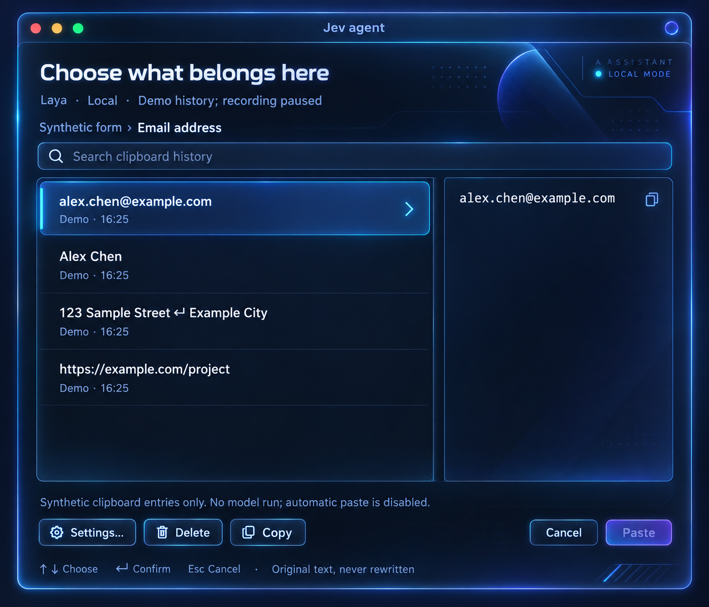

<h1 align="center">Jev agent</h1>

<h3 align="center">Copy what you need. Find what to paste.</h3>

<p align="center">
  A context-aware clipboard assistant for macOS.<br />
  Keep copying emails, links, addresses, and code. When you are ready to paste, Jev agent uses the field in front of you to suggest an entry from your history.
</p>

<p align="center">Run Laya on your Mac or connect the Jev API. Review the suggestion, then paste the original text.</p>

<p align="center">
  <a href="#preview"><strong>Preview</strong></a> &nbsp;·&nbsp;
  <a href="#getting-started"><strong>Get started</strong></a> &nbsp;·&nbsp;
  <a href="#use-cases"><strong>Use cases</strong></a> &nbsp;·&nbsp;
  <a href="#how-it-works"><strong>How it works</strong></a> &nbsp;·&nbsp;
  <a href="./README.zh-CN.md"><strong>简体中文</strong></a>
</p>

<p align="center">
  <a href="https://github.com/To3akaRin/Jev-agent/actions/workflows/ci.yml"></a>
  <a href="./LICENSE"></a>
  
</p>

<a id="preview"></a>

## Your clipboard, with context

<p align="center">
  
  <br />
  <sub>Interface concept preview.</sub>
</p>

You copied a meeting link, then an email address, then a shipping address. Now the cursor is in an email field. Jev agent can use that context to suggest which entry belongs there, instead of making you search through every recent copy.

**You stay in control:** inspect the complete text, choose another entry, or cancel. Recommendations never submit a form or send a message.

<a id="getting-started"></a>

## Get started on your Mac

You need an **Apple Silicon Mac**, Apple Command Line Tools or Xcode, Git, and [UV](https://docs.astral.sh/uv/getting-started/installation/). UV manages Python 3.12. The native app targets macOS 14+; the pinned Laya runtime has been tested on macOS 15.7.7.

If Apple developer tools are missing, run `xcode-select --install`. Then:

```bash
git clone https://github.com/To3akaRin/Jev-agent.git
cd Jev-agent
bash scripts/bootstrap.sh laya
open "dist/Jev agent.app"
```

Allow Jev agent in **System Settings → Privacy & Security → Accessibility**. Copy some text, focus an input field, and press **`⌘⇧V`**.

Prefer Jev? Use `bash scripts/bootstrap.sh jev`, then select **Jev · Cloud** and enter your key in the app's Settings. Use `both` to install both providers. The key is stored in macOS Keychain.

This is a source-built app with ad-hoc signing. Keep the checkout and its `.venv` in place; it is not a standalone, notarized installer. [Setup, updates, and troubleshooting →](./docs/GUIDE.md)

<a id="features"></a>
<a id="use-cases"></a>

## Fit the next field

| What you are doing | What Jev agent can use |
| --- | --- |
| Filling a contact form | Field labels such as name, email, and address |
| Sharing a meeting link | The focused field and recently copied URLs |
| Working with code | Code snippets and available text near the cursor |
| Writing a longer message | Original multiline entries you can inspect before pasting |

These are intended use cases, not accuracy guarantees. When the context is unavailable or the suggestion is unhelpful, search and select an entry manually.

<a id="how-it-works"></a>

## Copy → focus → review → paste

1. **Copy normally.** Jev agent records plain text while it is running.
2. **Focus a field.** Press `⌘⇧V` to capture the current app and supported field context.
3. **Get a suggestion.** Local retrieval shortlists up to six entries; your selected model chooses one or reports no match.
4. **Review and confirm.** Read the full original text, then press Return. Jev agent checks the target before pasting.

| Key | Action |
| --- | --- |
| `⌘⇧V` | Open the panel; configurable in Settings |
| `↑` / `↓` | Select an entry |
| `Return` | Confirm the selected entry |
| `Esc` | Cancel |
| `⌘V` | Keep using normal system paste |

If the target cannot be read or restored, use **Copy** and paste manually. Your selection is never rewritten by the model.

## Choose where the decision runs

| | Laya · Local | Jev · Cloud |
| --- | --- | --- |
| Runtime | MLX on your Apple Silicon Mac | TypeSafe's official API |
| Setup | Download the pinned multilingual model | Configure your API key |
| Network | Initial download; inference then runs offline | Required for recommendations |
| Model input | Processed on your Mac | Current context and candidate excerpts sent to TypeSafe |

**Laya is the default.** Switching providers is explicit. Errors never silently switch local processing to a cloud request. Jev-only setup does not require downloading Laya.

## Keep a small, useful history

- **Up to 3 days and 20 MB.** The oldest entries are removed when either limit is reached; model files and dependencies are separate.
- **Original text preserved.** URLs, whitespace, code, and multiline content stay intact.
- **Controls within reach.** Pause recording, exclude apps, delete one entry, or clear your history.
- **Focused context.** Read supported app and field information through Accessibility, without screenshots or OCR.

History is stored as local plaintext at `~/Library/Application Support/Jev agent/history`. Recognized confidential clipboard markers and secure fields are excluded. Jev sends only the context and shortlisted excerpts for requested cloud recommendations, not your complete history. [Data, permissions, and configuration →](./docs/GUIDE.md)

<a id="validation"></a>

## Built in the open, measured with real models

**Development preview.** Both providers, the native app, tests, and build scripts are implemented. Full automatic-paste acceptance across Chrome, Safari, and TextEdit is still in progress.

The latest 40-case synthetic comparison used identical prepared inputs:

| Provider | Top-1 selection | Median model-request time |
| --- | ---: | ---: |
| Laya | 40% | 12.6 ms |
| Jev | 85% | 327.9 ms |

Errors count as failures. These small synthetic results are not general accuracy claims, and request timing excludes the desktop interaction. Laya remains experimental; always review suggestions. [Results, raw responses, and remaining acceptance work →](./docs/VALIDATION.md)

## What comes next

Jev agent starts with clipboard suggestions. The next direction is a **Tab-triggered desktop assistant**: observe authorized user actions and application context, predict the next step, and let the user press Tab to execute the suggested computer-use action.

This is a future direction, outside the current clipboard release.

## Build with us

Use [Issues](https://github.com/To3akaRin/Jev-agent/issues) to report reproducible problems or propose improvements. For context-reading problems, include the app version, field type, provider, and a synthetic example.

The project uses **Swift/AppKit** for native integration and **Python** for model providers, connected by local JSON Lines pipes. It runs natively without a Docker service or listening server port.

```bash
bash scripts/check.sh
bash scripts/build-app.sh  # Quit Jev agent before rebuilding.
```

| Explore | Documentation |
| --- | --- |
| Install, update, configure, troubleshoot | [User and developer guide](./docs/GUIDE.md) |
| Configure environment defaults | [`.env.example`](./.env.example) and [configuration reference](./docs/GUIDE.md#configuration) |
| Understand modules and extend providers | [Project structure](./docs/GUIDE.md#project-structure) and [local API](./API.md) |
| Contribute a change | [Contributing](./CONTRIBUTING.md) and [specification](./docs/SPEC.zh-CN.md) |
| Follow progress | [Changelog](./CHANGELOG.md) and [validation](./docs/VALIDATION.md) |

### A few common questions

- **No suggestion?** Wait for the model, check its status, or select **Retry model**. Manual history stays available.
- **Paste unavailable?** Check Accessibility for your current app build. Unsupported fields remain copy-only.
- **Images or files?** This version supports plain text, links, code, and multiline entries.
- **Moved the checkout?** Rebuild to refresh its runtime paths. [More troubleshooting →](./docs/GUIDE.md#troubleshooting-and-removal)

## License and acknowledgments

Jev agent is [MIT licensed](./LICENSE), built with [Laya](https://huggingface.co/convaiinnovations/laya), [Laya-MLX](https://github.com/mizorewww/laya-mlx), and [TypeSafe's Jev API](https://docs.typesafe.ai/). Third-party packages and weights retain their own licenses; see [third-party notices](./THIRD_PARTY_NOTICES.md).

This is an independent project, not an official product of the model providers.
